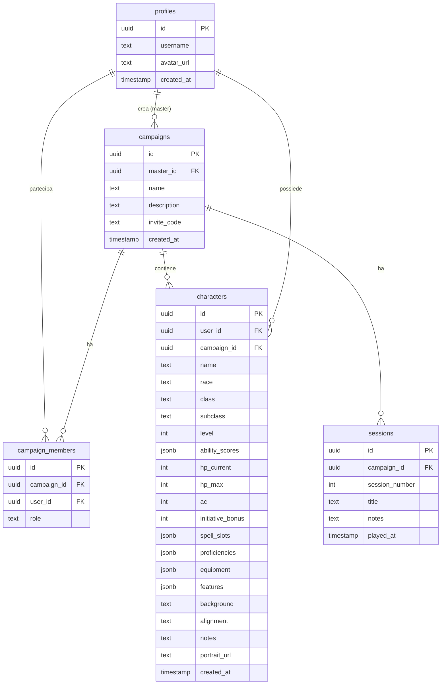
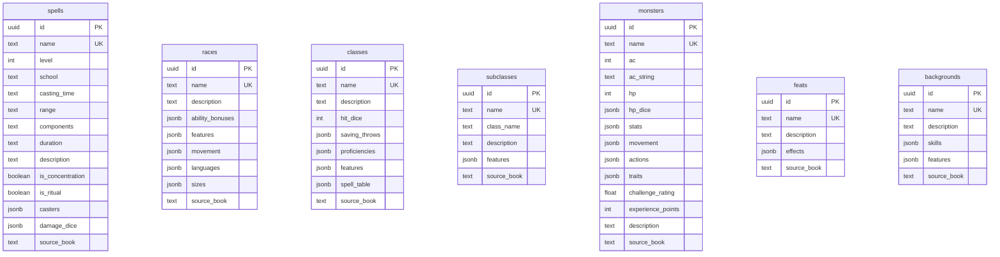

# 🎲 D&D Campaign Manager — Piano di Implementazione MVP

## Panoramica

Creazione di una web app per gestire campagne D&D 5e in presenza. Il MVP include: autenticazione, gestione campagne, schede personaggio, database incantesimi e dashboard Master. Stack: Next.js + Supabase. Design Dark Fantasy con glassmorphism.

---

## Schema Database (Supabase / PostgreSQL)

### Diagramma Relazioni



### Tabelle Dati D&D (read-only, popolate da Prism)



> [!NOTE]
> Le tabelle dati D&D usano `jsonb` per i campi complessi (features, effects, ecc.) perché la struttura Prism è molto nested. Questo evita di creare decine di tabelle join e rende le query semplici per un MVP.

### Row Level Security (RLS)

| Tabella | Regola |
|---|---|
| `profiles` | Ogni utente legge/modifica solo il proprio profilo |
| `campaigns` | Il Master legge/modifica le proprie campagne |
| `campaign_members` | Membri vedono la campagna a cui appartengono |
| `characters` | Il proprietario modifica il proprio PG; i membri della stessa campagna lo vedono in lettura |
| `sessions` | Solo il Master scrive; i membri leggono |
| Tabelle D&D | Lettura pubblica per tutti gli utenti autenticati |

---

## Struttura Progetto Next.js

```
DED/
├── dnd-campaign/           # Materiale campagna (inalterato)
├── prism/                  # File .prism sorgente
├── scripts/
│   └── import-prism.ts     # Script per importare dati Prism → Supabase
├── src/
│   ├── app/
│   │   ├── layout.tsx              # Root layout con font + theme
│   │   ├── page.tsx                # Landing / redirect
│   │   ├── login/page.tsx          # Auth
│   │   ├── dashboard/              # Dashboard Master
│   │   │   └── page.tsx
│   │   ├── campaign/
│   │   │   ├── [id]/page.tsx       # Vista campagna
│   │   │   └── new/page.tsx        # Crea campagna
│   │   ├── character/
│   │   │   ├── [id]/page.tsx       # Scheda PG
│   │   │   └── new/page.tsx        # Crea PG
│   │   ├── party/page.tsx          # Vista party
│   │   ├── spells/page.tsx         # Database incantesimi
│   │   └── join/[code]/page.tsx    # Join campagna via invite
│   ├── components/
│   │   ├── ui/                     # Componenti base (Button, Card, Input, etc.)
│   │   ├── character/              # Componenti scheda PG
│   │   ├── spells/                 # Componenti incantesimi
│   │   └── layout/                 # Header, BottomNav, Sidebar
│   ├── lib/
│   │   ├── supabase/
│   │   │   ├── client.ts           # Supabase browser client
│   │   │   ├── server.ts           # Supabase server client
│   │   │   └── types.ts            # Tipi generati da Supabase
│   │   └── utils.ts                # Utility (modifier calc, etc.)
│   └── styles/
│       └── globals.css             # Design system + variabili CSS
├── public/
├── PLANNING.md
├── package.json
├── next.config.ts
├── tsconfig.json
└── .env.local                      # SUPABASE_URL + SUPABASE_ANON_KEY
```

---

## Design System — Dark Fantasy

### Riferimento visivo


### Palette

| Token | Valore | Uso |
|---|---|---|
| `--bg-primary` | `#0a0f1a` | Background principale |
| `--bg-secondary` | `#0d1f2d` | Background gradient end |
| `--bg-card` | `rgba(255,255,255,0.05)` | Card glassmorphism |
| `--border-card` | `rgba(255,255,255,0.1)` | Bordi card |
| `--accent-teal` | `#00e5a0` | Accent primario (glow, active) |
| `--accent-amber` | `#f0a830` | Accent secondario (fantasy) |
| `--text-primary` | `#f0f0f0` | Testo principale |
| `--text-secondary` | `#8899aa` | Testo secondario |
| `--hp-green` | `#22c55e` | HP alta |
| `--hp-red` | `#ef4444` | HP bassa |
| `--danger` | `#ff4444` | Errori |

### Tipografia
- **Font**: Inter (Google Fonts) — moderno e leggibile
- **Headings**: Semi-bold, tracking leggero
- **Body**: Regular, 16px base

### Componenti chiave
- **Card**: `backdrop-filter: blur(12px)`, bordi `1px solid var(--border-card)`, `border-radius: 16px`
- **Button primary**: Background gradient `var(--accent-teal)`, glow on hover
- **HP Bar**: Gradient da verde a rosso in base al %
- **Stat Block**: Card 3×2 con numero grande + modifier piccolo sotto
- **Bottom Nav** (mobile): 4 tab con glow sull'icona attiva

### Layout Responsivo
- **Mobile (giocatore)**: Bottom tab bar, layout single-column, card a tutta larghezza
- **Desktop (Master)**: Sidebar sinistro + area di lavoro principale + pannello destro opzionale

---

## Fasi di Sviluppo

### Fase 0 — Setup (1-2 ore)
1. `npx create-next-app` nella repo
2. Configurare Supabase (creare progetto online)
3. Setup CSS design system
4. Creare tabelle DB via SQL migration

### Fase 1 — Auth + Campagna (2-3 ore)
1. Login/registrazione con Supabase Auth
2. Creazione campagna (nome + descrizione) con codice invito generato
3. Join campagna via codice
4. RLS su tutte le tabelle

### Fase 2 — Scheda Personaggio (3-4 ore)
1. Form creazione PG (nome, razza, classe, stats, HP, AC)
2. Visualizzazione scheda PG (layout come mockup)
3. Modifica valori dinamici (HP, spell slot)
4. Vista party (schede degli altri PG)

### Fase 3 — Database Incantesimi (2-3 ore)
1. Script import Prism → Supabase (de-duplicazione inclusa)
2. Pagina consultazione incantesimi con filtri (classe, livello, scuola)
3. Dettaglio incantesimo (componenti, durata, descrizione, danni per slot)

### Fase 4 — Dashboard Master (2-3 ore)
1. Vista d'insieme dei PG (HP attuali, statistiche)
2. Note di sessione
3. Accesso rapido al materiale campagna

---

## Verification Plan

### Test Automatici
Questo è un progetto for-fun, quindi non creeremo una suite di test completa. Verificheremo con:

1. **Build check**:
   ```bash
   npm run build
   ```
   Verifica che il progetto compili senza errori TypeScript.

2. **Script import Prism**:
   ```bash
   npx ts-node scripts/import-prism.ts --dry-run
   ```
   Verifica che il parsing dei file .prism funzioni e il conteggio de-duplicazione sia corretto.

### Verifica Manuale (via browser)
Dopo ogni fase, verificheremo nell'app:

1. **Auth**: Registrazione → login → redirect alla dashboard
2. **Campagna**: Creare campagna → copiare codice invito → (con altro browser) join con codice
3. **Scheda PG**: Creare personaggio → verificare che appaia nella campagna → modificare HP → verificare che il valore si aggiorni
4. **Spells**: Aprire pagina incantesimi → filtrare per "Wizard" livello 1 → verificare che la lista sia corretta
5. **Party**: Verificare che un giocatore veda le schede degli altri PG della stessa campagna

> [!IMPORTANT]
> Prima di iniziare a scrivere codice, è necessario creare un progetto Supabase online su [supabase.com](https://supabase.com) e ottenere le chiavi API (`SUPABASE_URL` e `SUPABASE_ANON_KEY`).
